# Laporan Proyek Machine Learning - [Muhammad Fahmi Hutomo]

## Project Overview

Sistem rekomendasi memainkan peran penting dalam meningkatkan pengalaman pengguna dengan menyajikan pilihan yang lebih relevan dan personal. Dalam industri hiburan, khususnya dalam layanan streaming dan platform film, sistem rekomendasi telah menjadi alat yang efektif dalam membantu pengguna menemukan film sesuai dengan preferensi mereka, sehingga mengurangi waktu pencarian dan meningkatkan kepuasan.

Sistem rekomendasi tidak hanya bermanfaat bagi pengguna, tetapi juga bagi penyedia layanan. Dengan menyarankan film yang sesuai dengan selera dan riwayat tontonan pengguna, platform dapat mendorong lebih banyak penayangan, meningkatkan loyalitas pelanggan, serta meningkatkan pendapatan.    

Menurut Prince Kumar Yadav et al. (2023), collaborative filtering dan content-based filtering umum digunakan dalam sistem rekomendasi.  Pendekatan collaborative filtering bekerja dengan menggabungkan riwayat perilaku pengguna serta preferensi yang mirip dari pengguna lain. Sementara itu, pendekatan content-based filtering menganalisis atribut spesifik dari suatu item yang telah diberi label sebelumnya, kemudian merekomendasikan item lain yang memiliki kesamaan sifat(label). Saat ini, banyak sistem rekomendasi yang menggabungkan kedua pendekatan ini untuk membentuk sistem hybrid, yang bertujuan meningkatkan keakuratan rekomendasi dengan memanfaatkan kekuatan dari masing-masing metode.    

Referensi: 
- [P. K. Yadav, P. Raj, N. Sharma, and R. Gupta, "Movie Recommendation System by Using Machine Learning," Department of Information Technology, IIMT College of Engineering, Greater Noida, Uttar Pradesh, 2023.](https://ijcrt.org/papers/IJCRT2307458.pdf?form=MG0AV3)

## Business Understanding

### Problem Statements
1. Bagaimana merekomendasikan film berdasarkan kemiripan konten (genre)?
2. Bagaimana memprediksi preferensi pengguna berdasarkan riwayat rating dari user lain?

### Goals
1. Mengembangkan sistem rekomendasi Content-Based Filtering berdasarkan genre film dengan score evaluasi `map > 0,85`
2. Membangun model Collaborative Filtering berbasis neural network dengan score evaluasi `rmse < 0,20`

### Solution Approach
1. **Content-Based Filtering**:
   - Menggunakan TF-IDF untuk ekstraksi fitur teks genre.
   - Menghitung similarity dengan cosine similarity.

2. **Collaborative Filtering**:
   - Neural network dengan embedding layer.
   - Optimasi menggunakan Adam dan RMSE sebagai metrik evaluasi.

## Data Understanding

Source yang digunakan dalam proyek ini adalah MovieLens 100K  yang didownload dari [https://www.kaggle.com/datasets/abhikjha/movielens-100k](https://www.kaggle.com/datasets/abhikjha/movielens-100k).      
Pada proyek ini ada dua dataset yang akan digunakan, yaitu **movies.vs(movies_df)** dan **ratings.csv(ratings_df)**.       

**movies.csv (movies_df)**    
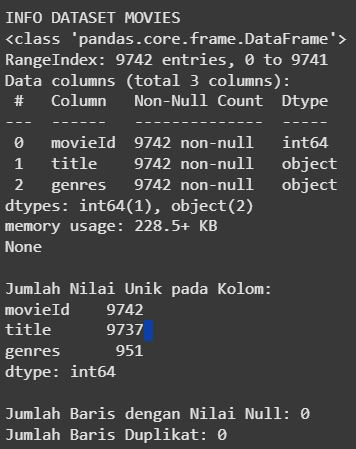  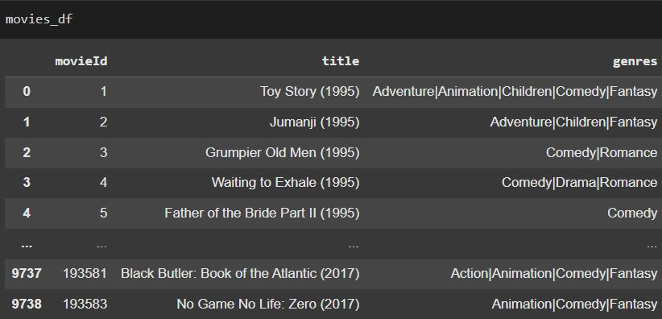       
Dataset ini berisi informasi tentang judul dan genre dari dari 9.742 film. Tidak ada missing value atau duplikat pada **movies_df**. Dataset ini terdari dari 3 fitur, yaitu `movieId, title, genres`. Berikut penjelasan detail setiap fiturnya:      
- `movieId`, merupakan ID unik yang mengidentifikasi setiap film dalam dataset.          
   - **Tipe Data**: Integer          
   - **Contoh Nilai**: `1`, `2`, `3`, dst.      
- `title`, merupakan Judul film beserta tahun rilisnya.       
   - **Tipe Data**: String    
   - **Contoh Nilai**: `"Toy Story (1995)"`, `"Jumanji (1995)"`.  
   - **Catatan**: Terdapat 9.737 judul unik, beberapa film memiliki judul yang sama.      
- `genres` merupakan  genre film . Satu film memiliki lebih dari satu genre yang dipisahkan oleh tanda pipe (`|`).              
   - **Tipe Data**: String     
   - **Contoh Nilai**: `"Adventure|Animation|Children"`, `"Action|Animation|Comedy|Fantasy"`.  
   - **Catatan**: Terdapat 951 kombinasi genre berbeda, menunjukkan variasi yang cukup tinggi dalam pengategorian film.    

- Film-film yang mengandung unsur genre Drama, Comedy banyak diproduksi, masing-masing lebih dari 4000 dan 3000 film.   
   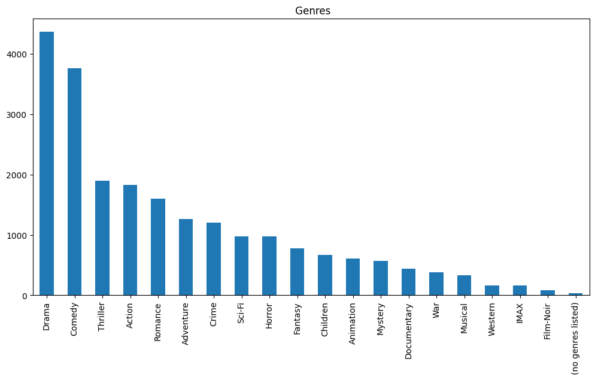          


**ratings.csv (ratings_df)**     
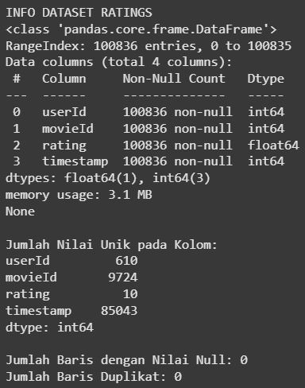 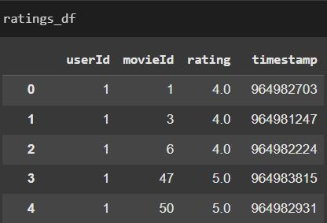        
Dataset ini berisi rating yang diberikan oleh pengguna terhadap film yang telah mereka tonton. Tidak ada missing value atau duplikat pada **ratings_df**. Dataset ini terdiri dari fitur `userId, movieId, rating, timestamp`. Berikut penjelasan detail setiap fiturnya:
- `userId`, merupakan ID unik yang mengidentifikasi pengguna yang memberikan rating.     
   - **Tipe Data**: Integer      
   - **Contoh Nilai**: `1`, `2`, `3`, dst.  
   - **Catatan**: Terdapat 610 pengguna unik dalam dataset.  

- `movieId`, merupakan ID film yang diberi rating (berkaitan dengan `movieId` di `movies_df`).  
   - **Tipe Data**: Integer      
   - **Contoh Nilai**: `1`, `2`, `3`, dst.  
   - **Catatan**: Terdapat 9.724 film yang diberi rating, beberapa film tidak memiliki rating.  

- `rating`, merupakan nilai rating yang diberikan pengguna pada suatu film.  
   - **Tipe Data**: Float 
   - **Contoh Nilai**: `4.0`, `3.5`, `5.0`.  
   - **Catatan**: Terdapat 10 nilai unik (bernilai antara 0.5–5.0 dengan selisih antar nilai 0,5).    

- `timestamp`, merupakan waktu rentang saat rating diberikan, dalam format detik sejak **1 Januari 1970 (epoch time)**.          
   - **Tipe Data**: Integer        
   - **Contoh Nilai**: `964982703`, `964982296`.  
   - **Catatan**: Kolom ini bisa dikonversi ke format tanggal/waktu jika diperlukan untuk analisis temporal.  Namun, dalam projek ini tidak akan digunakan.

- lebih dari 35% film mendapatkan rating tinggi ( rating >= 4)      
      - lebih dari 12,5% film mendapatkan rating 5    
      - lebih dari 8% film mendapatkan rating 4.5     
      - lebih dari 25% film mendapatkan rating 4      
        

**movies_df** dan **ratings_df** akan digabung di bagian data preparation dan data gabungan ini akan digunakan dalam proses modeling.       

## Data Preparation     

Langkah-langkah yang dilakukan pada tahap preparation:
1. **movies_new**     
- Menggabungkan `movies_df` dan `ratings_df` untuk menghasilkan dataframe baru `movies_new` yang terdiri dari `'userId', 'movieId', 'title', 'genres', 'rating'`.     
- Memfilter data `movies_new`. Hanya mempertahankan data dengan kemunculan userId minimal 10 kali dan kemunculan movieId minimal 100 kali. Ini dilakukan untuk mengurangi data yang jarang agar kualitas rekomendasi akurat.      

2. **Content_based_prep**     
- Membuat dataframe baru `content_based_df = movies_new[['movieId', 'title', 'genres']].copy()`. Dataframe ini akan digunakan untuk membuat model content-based filtering.    
- Menghapus duplikat pada `content_based_df`.    
- mengubah format `genres`. Pipe diganti dengan spasi dan huruf dibuat lowercase agar bisa dibaca TF-IDF Vectorizer dengan mudah. `Adventure|Animation|Children|Comedy|Fantasy` menjadi `adventure animation children comedy fantasy`.   
- Mengubah `genre` menjadi representasi numerik `genre_tfidf_matrix` menggunakan TF-IDF Vectorizer agar dapat diukur kemiripan antar genre film menggunakan `cosine_similarity`.    
   - `genre_tfidf_matrix` terdiri dari 138 baris dan 18 kolom.    
   - Kolom-kolomnya seperti berikut ini: `'action', 'adventure', 'animation', 'children', 'comedy', 'crime',
       'drama', 'fantasy', 'fi', 'horror', 'imax', 'musical', 'mystery',
       'romance', 'sci', 'thriller', 'war', 'western'`.      
 

3. **Collaborative_prep**     
- Membuat dataframe baru`collab_based_df = movies_new[['userId', 'movieId', 'rating']].copy()`. Dataframe ini akan digunakan untuk membuat model collaborative filtering.     
- Encoding `userId` dan `movieId` dari  `collab_based_df` menggunakan fungsi `enumerate` untuk menghasilkan kolom baru `user` dan `movie`. Kedua fitur ini akan digunakan sebagai variabel prediktor pada proses training.    
- Inisialisasi  `num_movies`, `num_ratings` untuk modeling dan `min_rating`, `max_rating` untuk normalisasi `rating`ketika data splitting.  
4. **Data splitting**   
   - Memisahkan fitur prediktor x dan target y.     
   - Normalisasi  target `rating` ke range 0-1.
   - Split data 80-20 untuk training-validation.
   ```python
      x = collab_based_df[['user', 'movie']].values
      y = collab_based_df['rating'].apply(lambda x: (x - min_rating) / (max_rating - min_rating)).values

      train_indices = int(0.8 * collab_based_df.shape[0])
      x_train, x_val, y_train, y_val = (x[:train_indices], x[train_indices:], y[:train_indices], y[train_indices:])
   ```      

## Modeling
Pada proyek ini ada dua pendekatan sistem rekomendasi yang dikembangkan, yaitu content-based filtering dan collaborative filtering.    

### 1. Content-Based Filtering      

Pendekatan content-based filtering dilakukan dengan menghitung kemiripan antar genre film berdasarkan representasi numerik genre film `genre_tfidf_matrix` menggunakan `cosine_similarity`. Nilai `cosine_similarity` ini kemudian disimpan dalam bentuk dataframe agar dapat digunakan di dalam fungsi `movie_recommendations`.     

```python
cosine_sim = cosine_similarity(genre_tfidf_matrix)

cosine_sim_df = pd.DataFrame(
    cosine_sim,
    index=content_based_df['title'],
    columns=content_based_df['title']
)
```

Fungsi movie_recommendations akan menghasilkan rekomendasi top-N (default=5) film `k` yang paling mirip dengan film acuan yang diberikan `judul_film` (selain film itu sendiri).     
`movie_recommendations(judul_film, similarity_data=cosine_sim_df, items=content_based_df[['title', 'genres']], k=5)`    
Ketika pengguna memilih film "Toy Story (1995)" dengan k=10, sistem akan menampilkan sepuluh film lain dengan genre yang paling mirip berdasarkan perhitungan kemiripan tersebut.      
Hasilnya seperti di bawah ini:   
<!-- 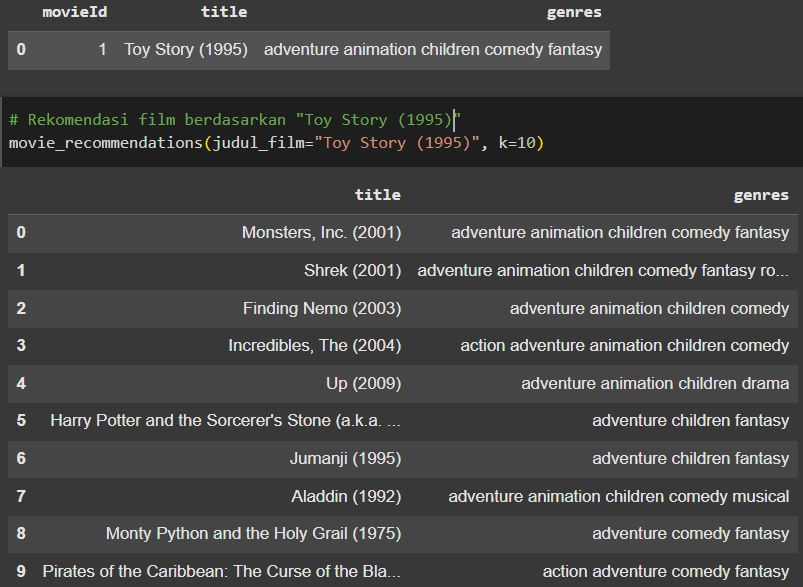     -->

**Kelebihan**:
- Tidak memerlukan data historis user
- Efektif untuk item baru (cold-start)

**Kekurangan**:
- Terbatas pada kemiripan konten saja
- Tidak mempertimbangkan preferensi personal

### 2. Collaborative Filtering      

Pendekatan collaborative filtering dilakukan dengan membangun model RecommenderNet menggunakan framework TensorFlow. Pada tahap inisialisasi kelas, didefinisikan empat buah embedding layer—dua untuk pengguna dan dua untuk film. Masing-masing pengguna dan film direpresentasikan oleh vektor embedding berdimensi rendah (embedding_size) yang dilatih untuk menangkap representasi laten preferensi pengguna dan karakteristik film.

Selain vektor utama, ditambahkan pula bias embedding untuk setiap pengguna dan film. Komponen ini bertujuan untuk menangkap kecenderungan pengguna tertentu dalam memberikan rating lebih tinggi atau lebih rendah dari rata-rata, serta kecenderungan sebuah film untuk secara umum menerima rating yang lebih tinggi atau rendah. Semua layer embedding diinisialisasi dengan metode he_normal dan diberikan regularisasi L2 untuk mencegah overfitting.

Model di-compile menggunakan fungsi binary crossentropy sebagai loss function, dan Adam optimizer untuk proses pembelajaran, dengan metrik evaluasi berupa Root Mean Squared Error (RMSE). 
```python    
model = RecommenderNet(num_users, num_movies, embedding_size=50) 

model.compile(
    loss = tf.keras.losses.BinaryCrossentropy(),
    optimizer = keras.optimizers.Adam(learning_rate=0.001),
    metrics=[tf.keras.metrics.RootMeanSquaredError()]
)
```      
Proses pelatihan dilakukan selama 40 epoch dengan ukuran batch 8, serta dilakukan validasi terhadap data validasi (x_val, y_val) untuk memantau performa model.      
```python
history = model.fit(
   x = x_train,
   y = y_train,
   batch_size = 8,
   epochs = 40,
   validation_data = (x_val, y_val)
)
```      
Setelah pelatihan selesai, sistem digunakan untuk memberikan rekomendasi kepada pengguna tertentu dengan langkah-langkah seperti di bawah ini:    
Pertama, dipilih satu sample user secara acak dari data interaksi `collab_based_df`. Lalu diambil daftar film yang pernah ditonton dan diberi rating tinggi oleh pengguna tersebut, seperti di bawah ini:       
<!-- 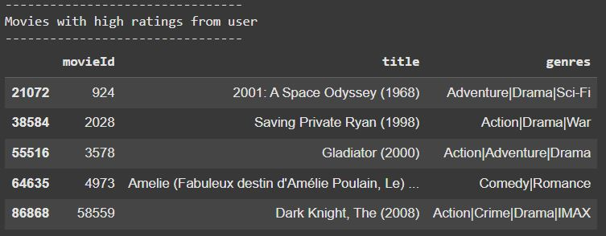 -->


Selanjutnya, sistem mengidentifikasi film yang belum ditonton oleh pengguna dengan mengeliminasi film yang ada dalam histori rating-nya. Daftar film yang belum ditonton ini kemudian dikonversi ke dalam bentuk encoding numerik yang sesuai, dan dipasangkan dengan ID pengguna (yang juga telah di-encode) untuk membentuk input array user_movie_array. Model kemudian digunakan untuk memprediksi kemungkinan rating terhadap seluruh film yang belum ditonton. Hasil prediksi tersebut diurutkan untuk mendapatkan skor tertinggi, dan 10 film dengan skor prediksi tertinggi dikembalikan sebagai Top-10 Movie Recommendation.     
Hasilnya seperti di bawah ini:    
<!-- 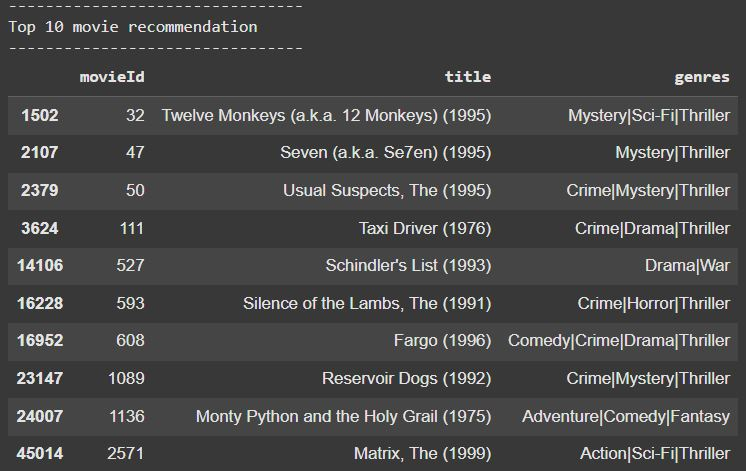 -->


**Kelebihan**:
- Mempertimbangkan pola preferensi user
- Dapat menemukan hubungan yang tidak terlihat dari konten

**Kekurangan**:
- Membutuhkan data historis yang cukup
- Masalah cold-start untuk user/item baru

## Evaluation

### Metrik Evaluasi
1. **Content-Based**:
   - Mean Average Precision (MAP): Rata-rata dari Average Precision (AP) untuk semua item yang direkomendasikan, mengukur presisi rekomendasi dengan mempertimbangkan peringkat relevansi.      
   <!-- 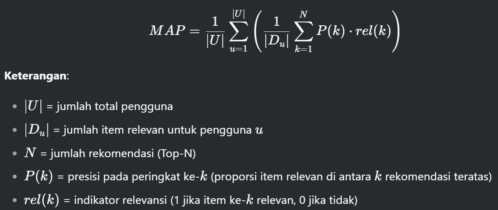    -->
       
   - MAP bekerja dengan menghitung presisi pada setiap posisi rekomendasi untuk setiap pengguna, kemudian mengambil rata-rata presisi tersebut untuk semua item relevan. Nilai MAP menunjukkan seberapa baik model menempatkan item relevan di peringkat atas; semakin tinggi nilainya, semakin akurat rekomendasi.

2. **Collaborative**:
   - Root Mean Squared Error (RMSE): Menunjukkan seberapa besar rata-rata kesalahan prediksi model terhadap nilai sebenarnya.    
   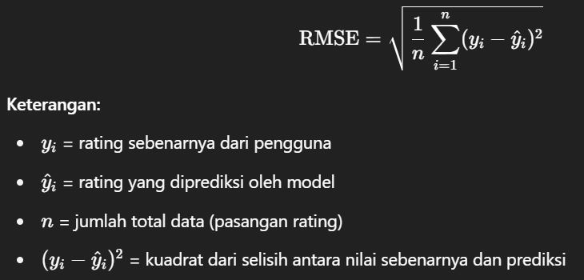  
      
     
   - RMSE bekerja dengan menghitung selisih antara rating sebenarnya $y_i$ dan rating yang diprediksi $\hat{y}_i$, lalu mengkuadratkannya agar semua kesalahan bernilai positif. Setelah itu, semua selisih kuadrat dijumlahkan, dirata-rata dengan membaginya dengan jumlah data $n$, dan hasilnya diakar. Nilai RMSE menunjukkan seberapa besar rata-rata kesalahan prediksi; semakin kecil nilainya, semakin akurat model.
         

**Hasil Evaluasi**:
- Model content-based filtering mencapai score MAP  yang memuaskan `map > 0,85`.     
   <!-- 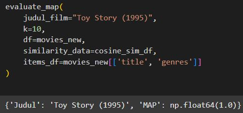   -->
      
   
   - score MAP untuk 10 rekomendasi teratas yang diberikan mencapai `1.0`. Ini berarti bahwa rekomendasi yang diberikan menunjukkan relevansi genre yang tinggi terhadap film acuan.      


- Model collaborative filtering mencapai score RMSE yang baik `rmse < 0,20`.      
   <!--     -->
      
   - Score akhir pada epoch ke 40: `rmse_training: 0.16,  rmse_validation: 0.19`. Ini menunjukkan bahwa model mampu memberikan rekomendasi film berdasarkan prediksi rating yang akurat (selisih rmse training dan validation kecil hanya sekitar 0,025).   

**Kesimpulan**    
- Model content-based yang dikembangkan memenuhi goals yang telah ditentukan, yakni memiliki score `map = 1,0`.
- Model collaborative filtering yang dikembangkan memenuhi goals yang telah ditentukan, yakni memiliki score `rmse_training = 0.16,  rmse_validation = 0.19`
- Dengan hasil seperti yang dikemukakan di atas, dapat dikatakan bahwa sistem ini mampu memberikan rekomendasi film yang relevan kepada user. Hal ini akan berdampak terhadap peningkatan retention rate dari para customer karena mereka memperoleh pelayanan rekomendasi yang sesuai dengan preferensi mereka.
- Untuk pengembangan selanjutnya, kedua pendekatan ini akan dikombinasikan menjadi pendekatan hybrid filtering agar kedua model dapat saling melengkapi.

**---Ini adalah bagian akhir laporan---**
